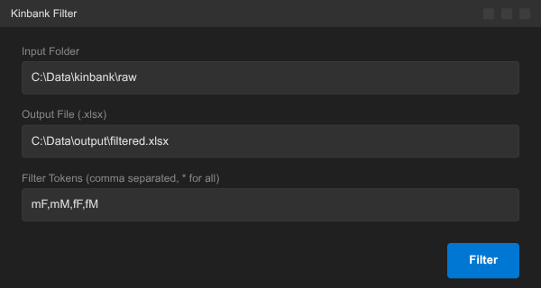

# KinbankFilter

A lightweight Windows tool for filtering and exporting data from the [Kinbank](https://github.com/SimonGreenhill/kinbank) database.

## About Kinbank

[Kinbank](https://simon.net.nz/project/kinbank/) is a global database of kinship terminology containing 210,903 kinterms from 1,229 spoken languages. It was created by [Simon J. Greenhill](https://simon.net.nz/) and collaborators at the Max Planck Institute for Evolutionary Anthropology and the University of Auckland.

The database enables researchers to explore cross-linguistic diversity in kinship organisation and test hypotheses about language evolution using phylogenetic methods.

Publication: Passmore S, Barth W, Greenhill SJ, et al. (2023). *Kinbank: A global database of kinship terminology.* PLoS ONE.

## Features

- Recursive CSV file reading from Kinbank raw data folders
- Filter entries by parameter tokens (e.g., `mF`, `fZ`, `mB`)
- Export filtered results to Excel (.xlsx)
- Wildcard support (`*`) to export all entries

## Usage

1. Download the raw CSV files from [Kinbank](https://github.com/SimonGreenhill/kinbank)
2. Set the input folder path (folder containing CSV files)
3. Set the output file path (must end with `.xlsx`)
4. Enter filter tokens separated by commas, or `*` for all entries
5. Click Filter

## Filter Tokens

Kinbank uses a standardized notation for kinship relations. Common tokens include:

| Token | Meaning |
|-------|---------|
| `mF` | Father (male speaker) |
| `fF` | Father (female speaker) |
| `mM` | Mother (male speaker) |
| `mFB` | Father's brother |
| `mMZ` | Mother's sister |
| `mFeB` | Father's elder brother |

See the [Kinbank documentation](https://github.com/SimonGreenhill/kinbank) for the complete list of kin types.

## Requirements

- Windows with .NET Framework 4.7.2
- Kinbank raw data files (CSV format)

## Build

Open `KinbankFilter.sln` in Visual Studio and build the solution.

## License

MIT

## Acknowledgments

This tool is designed to work with data from the Kinbank project. If you use Kinbank data in your research, please cite:

> Passmore, S., Barth, W., Greenhill, S. J., Quinn, K., Sheard, C., et al. (2023). Kinbank: A global database of kinship terminology. *PLoS ONE*.
